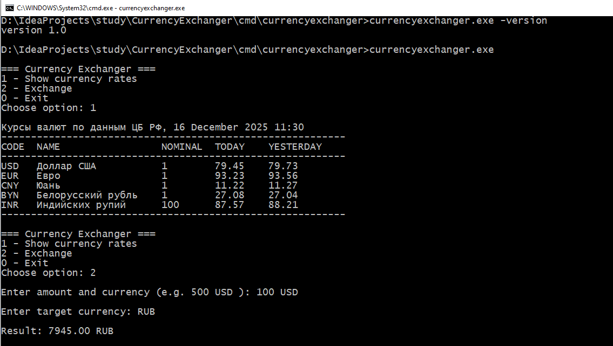

# CurrencyExchanger


## Features

- Fetches official exchange rates from the Central Bank of Russia (CBR)
- Currency conversion
- In-memory rates cache

## Project Structure

```
CurrencyExchanger/
├── go.mod
├── api/
│   └── cbr/
│       ├── cbr_api.go          # CBR API client
│       ├── exchange.go         # Currency exchange logic
│       ├── exchange_test.go    # Tests for exchange logic
│       ├── rates_cache.go      # Exchange rates cache
│       └── rates_cache_test.go # Cache tests
├── model/
│   └── currency/
│       ├── currency.go         # Currency domain model
│       └── currency_codes.go   # Supported currency codes
├── ui/
│   └── ui.go                   # Simple CLI
└── utils/
    └── format/
        ├── format.go           # Formatting helpers
        └── format_test.go      # Formatting tests
```


## Usage



### Command-line options

The application provides a simple interactive menu:

```
=== Currency Exchanger ===
1 - Show currency rates
2 - Exchange
0 - Exit
```

**Options:**

- **1 — Show currency rates**  
  Displays current and previous exchange CBR rates

- **2 — Exchange**  
  Converts an entered amount from a source currency to a target currency

  Example:
  ```
  Enter amount and currency (e.g. 500 USD ): 100 USD
  Enter target currency: RUB
  Result: 7945.00 RUB
  ```

---

### Version flag


```bash
currencyexchanger.exe --version
```

Output:

```
version 1.0
```
